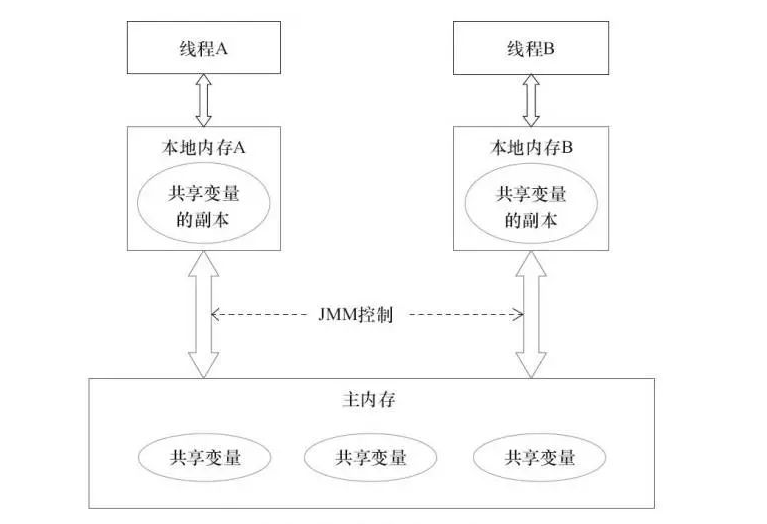

# Java

## JUC 多线程及高并发

### volatitle

volatitle 是 Java 虚拟机提供的轻量级的同步机制

volatitle 具有三大特性：

* 保证可见性
* 不保证原子性
* 禁止指令重排

#### 常见问题

1. 可见性是什么

   查看JVM的JMM内存模型

2. 原子性是什么意思

   不可分割，完整性，即某个线程处理某个业务，中间不可被分割，需要整体完整要么同时完成，要么同时失败

3. 如何解决原子性

   使用synchronized、juc包的Atomic

4. 指令重排

   单线程环境确保最终执行结果和代码顺序执行的结果一致，即指令会按顺序执行不会出现乱序执行

   处理器在进行重排序时必须考虑指令之间的数据依赖性

   多线程环境中线程交替执行，由于编译器优化重排的存在，两个线程中使用的变量能否保证一致性是无法确定的，结果无法预测

5. 你在哪里使用过volatitle

   单例模式（DCL双端检锁）

### CAS

**CAS**： （Compare-And-Swap）意思是 比较并交换，它是一条CPU并发原语；它的功能是判断内存某个位置的值是否为预期值，如果是一样则更改为新值，这个过程是原子的。

**底层原理**：依靠Unsafa类，Unsafe类存在于sun.misc包中，其内部方法操作可以像C的指针一样直接操作内存。CAS是一种系统原语，原语是由若干条指令组成，并且执行原语必须是连续的，可以看作把一组指令看成一条CPU指令执行，要么全部执行完，要么全部失败，所以不会造成数据不一致问题。

**例如**：getAndSet 方法，CAS使用自旋方式，每次比较，如果预期与实际值一致，才更新新值。

**缺点**：

1. 循环时间长开销大
2. 只能保证一个共享变量的原子操作
3. ABA问题

**常见问题**：

1. 什么是ABA

   atomic原值A，到最后判断时候值还是一样A，中间有一个改变过程B

2. 原子引用、版本原子引用

   原子引用：AtomicReference

   版本原子引用：AtomicStampedReference

3. 如何解决ABA

   使用版本原子引用

### 锁

#### 公平锁

指多个线程按照申请锁的顺序来获取锁,类似队列,先进先出

#### 非公平锁

指多个线程获取锁的顺序并不是按照申请锁的顺序，而是看谁先抢占到CPU执行权，谁就先执行，所以有可能会造成优先级反转或者饥饿现象

#### 可重入锁 / 递归锁

指同一个线程对已加锁的资源，可以重复对该资源获取锁

#### 自旋锁

指尝试获取锁的线程不会立即阻塞，而是采用循环的方式去尝试获取锁。这样的好处是减少线程上下文切换的消耗，缺点是循环会消耗CPU

#### 独占锁(写锁)/共享锁(读锁)/互斥锁

独占锁：指该锁一次只能被一个线程所持有

共享锁：指该锁可被多个线程所持有

ReentrantReadWriteLock其读锁是共享锁，其写是独占锁

#### 常见问题

1. ReentrantLock

   通过构造器，可以指定该锁是否为公平锁，默认是非公平锁，非公平锁的优点是吞吐量比公平锁大；独占锁

2. synchronized

   非公平锁、可重入锁、独占锁
   
3. CountDownLatch 倒数（减法）

   让一些线程阻塞直到另一些线程完成一系列操作后才被唤醒

   CountDownLatch主要有两个方法，当一个或多个线程调用 await 方法时，调用线程会被阻塞。其他线程调用 countDown 方法会将计数器减1，当计数器的值变为零时，调用线程会被唤醒，继续执行。

4. CyclicBarrier 屏障（加法）

   让一组线程到达一个屏障（同步点）时被阻塞，直到最后一个线程到达屏障时，屏障才会开门，所有被屏障拦截的线程才会继续执行，线程进入屏障通过CyclicBarrier的 await 方法

5. Semaphore 信号量

   信号量主要用于两个目的，一个是用于多个共享资源的互斥使用，另一个用于并发线程数的控制

   

## 集合

### ArrayList

线程不安全；

**出现异常**：

1. java.util.ConcurrentModificationException 并发修改异常：边修改，边使用迭代器读问题
2. java.lang.ArrayIndexOutOfBoundsException 数组越界，添加问题

**解决方案**：

1. Vector
2. Collections.synchronizedList(new ArrayList<>())
3. CopyOnWriteArrayList 写时复制

### HashSet

**线程不安全解决方案**：

1. Collections.synchronizedSet(new HashSet<>())
2. CopyOnWriteArraySet 底层是CopyOnWriteArrayList

### HashMap

**线程不安全解决方案**：

1. Collections.synchronizedMap(new HashMap<>())
2. ConcurrentHashMap

# JVM

## JMM

JMM （Java内存模型 Java Memory Model ）是一种抽象的概念并不真实存在，它描述的是一组规则或规范，通过这组规范定义了程序中各个变量（包括实例字段，静态字段和构成数组对象的元素）的访问方式

JMM 关于同步的规定：

* 线程解锁前，必须把共享变量的值刷新回主内存
* 线程加锁前，必须读取主内存的最新值到自己的工作内存
* 加锁解锁是同一把锁

JMM 三个特性规定：

* 可见性
* 原子性
* 有序性

由于JVM运行程序的实体是线程，而每个线程创建时JVM都会为其创建一个工作内存，工作内存是每个线程的私有区域，而Java内存模型中规定所有变量都存储在主内存，主内存是共享内存区域，所有线程都可以访问；不同的线程间无法访问对方的工作内存，线程间的通信必须通过主内存来完成。线程对变量的操作：首先将变量从主内存拷贝到自己的工作内存，然后对变量进行操作，操作完成后再将变量写回主内存。线程对共享变量访问的工作图如下：

