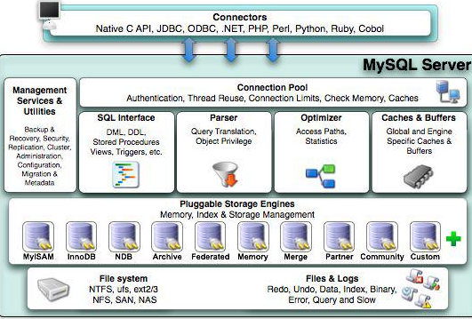
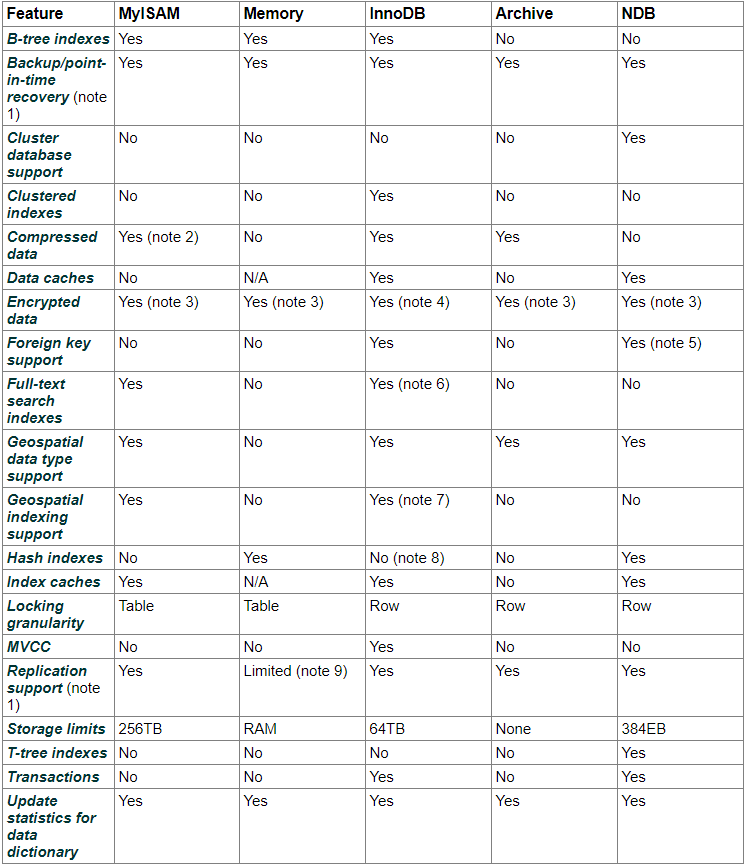

---
内容来源引用书：MySQL技术内幕 InnoDB存储引擎 第2版
---

### 1. 理解数据库、数据库的实例

数据库：是文件的集合，是依照某种数据模型组织起来并存放于二级存储器中的数据集合  
数据库实例：是程序，是位于用户与操作系统之间的一层数据管理软件  
简单来说：数据库是由一个个文件组成的，要对这些文件进行修改，则需要数据库实例来完成这些操作

### 2. mysql体系结构
  
1. 连接池组件  
2. 管理服务和工具组件  
3. SQL接口组件  
4. 查询分析器组件  
5. 优化器组件  
6. 缓冲组件  
7. 插件式组件储存引擎  
8. 物理文件  
注意：存储引擎是基于表，而不是数据库

### 3. 存储引擎
可以使用不同得存储引擎建立不同的表  
1. InnoDB 存储引擎  
&emsp;支持事务，使用行锁设计、支持外键，支持非锁定读（即默认读取操作不会产生锁）  
&emsp;使用多版本并发控制（MVCC）来获取高并发性
&emsp;实现了SQL标准的4中隔离级别，默认repeatable（可重复读）级别  
&emsp;使用next-key locking策略避免幻读  
&emsp;提供插入缓冲、二次写、自适应哈希索引、预读等高性能和高可用的功能  
&emsp;对于表数据的存储，使用聚集（clustered）的方式，则按主键的顺序存放，如果没有显示指定主键，则会自动为每一行生成一个6字节的ROWID作为主键  
2. MyISAM 存储引擎  
&emsp;不支持事务，使用表锁设计，支持全文索引  
&emsp;缓冲池只缓存索引文件，而不缓冲数据文件  
&emsp;表由MYD和MYI组成，MYD用来存放数据文件，MYI用来存放索引文件  
3. NDB 存储引擎  
&emsp;其是一个集群存储引擎，类似Oracle的RAC集群，Oracle RAC share everything机构，而NDB是share nothing的集群架构  
&emsp;数据全部放在内存，可将非索引数据放在磁盘，因此主键查找的速度极快  
&emsp;添加NDB数据存储节点可以线性提高数据库性能  
&emsp;存在问题是：连接操作（JOIN）是MySQL数据库层完成的，不是存储引擎层完成。则复杂的连接操作需要巨大网络开销，因此这种情况查询速度很慢  
4. Memory 存储引擎  
&emsp;数据存放在内存，适合作为存储数据时的临时表、数据仓库的纬度表  
&emsp;使用哈希索引  
&emsp;只支持表锁、并发性差、不支持TEXT和BLOB列类型  
&emsp;如作为临时表存放查询的中间结果集，如结果集大于设置容量、包含TEXT或BLOB列数据，会自动转换到MyISAM存储引擎放到磁盘  
5. Archive 存储引擎  
&emsp;使用zlib算法将数据行压缩存储，比例可达1：10  
&emsp;只支持 INSERT 和 SELECT 操作，支持索引  
&emsp;适合存储归档数，如日志信息  
&emsp;使用行锁实现高并发插入，但本身不是事务安全的存储引擎，主要目标是提供高速插入和压缩功能  
6. Federated 存储引擎  
&emsp;不存放数据，只是指向一台远程MySQL数据库服务器上的表（只支持MySQL数据表，不支持异构数据库表）  
7. Maria 存储引擎  
&emsp;支持缓存数据和索引文件，应用了行锁设计，提供MVCC功能，支持事务和非事务安全的选项，以及更好的BLOB字符类型的处理性能  
8. 其他存储引擎

### 4. 存储引擎比较  
  

### 5. MySQL连接

​	本质是进程通信，进程常用的通信方式：管道、命名管道、命名字、TCP/IP套接字、UNIX域套接字
​	TCP/IP套接字所有平台都支持；连接到MySQL实例时，MySQL会检查权限试图（mysql.user）
​	命名管道和共享内存；部分平台同一台服务器命名管道，MySQL配置文件启用 --enable-name-pipe；共享内存，Mysql配置文件添加 --shared-memory，客户端需要用 --protocol=memory 选项
​	UNIX域套接字，可用在Linux和Unix环境下，MySQL实例与客户端同一台服务器下，配置文件指定套接字路径，如 --socket=/tmp/mysql.sock，客户端使用mysql -uroot -S /tmp/mysql.sock

### 6. InnoDB 存储引擎

​	其是第一个完整支持ACID事务的MySQL存储引擎
​	InnoDB存储引擎有多个内存块，可以认为这些内存块组成了一个大的内存池，负责工作：维护进程/线程、缓存磁盘数据、重做日志缓冲等

##### InnoDB存储引擎是多线程的模型，不同的线程处理不同的任务

  1. Master Thread
     其实核心的后台线程，主要负责将缓冲池的数据异步刷新到磁盘，保证数据的一致性，包括脏页的刷新、合并插入缓冲、UNDO页的回收等
  2. IO Thread，大量使用异步IO（AIO）处理写IO请求，主要复杂IO请求的回调，4个IO：write、read、insert buffer、log；现默认read thread 和 write thread 分别为4个，可以通过 innodb_write_io_threads 和 innodb_read_io_threads 设置；
     查看innodb版本：SHOW VARIABLES LIKE 'innodb_version'\G;
     查看write、read线程数量：SHOW VARIABLES LIKE 'innodb_%io_threads'\G;
     查看InnoDB的IO Thread：SHOW ENGINE INNODB STATUS\G;
  3. Purge Thread
     事务提交后，其undolog可能不需要了，因此需要Purge Thread回收分已使用并分配的undo页，1.1版本后已是单独的线程进行，可以通过修改配置文件来修改其线程个数 innodb_purge_threads=4
  4. Page Cleaner Thread
     其作用是将之前版本中脏页的刷新操作都放入到单独的线程中来完成

##### 内存

1. 缓冲池
   InnoDB存储引擎基于磁盘存储，按页的方式管理，可视为基于磁盘的数据库系统；基于磁盘的数据库系统通常使用缓冲池技术提供性能；缓冲池简单来说是一块内存区域；页从缓冲池刷新回磁盘，并不是每次也发生更新时触发，而通过Checkpoint机制刷新；
   综上所述，缓冲池大小直接影响数据库的性能
   缓冲池配置参数：innodb_buffer_pool_size
   缓冲池实例个数配置参数：innodb_buffer_pool_instances
   查看缓冲池的使用状态： SELECT * FROM information_schema.INNODB_BUFFER_POOL_STATS\G;
2. LRU List、Free List 和 Flush List
   内存区域管理，通常来说，缓冲池通过LRU（Latest Recent Used，最近最少使用）算法进行管理，则频繁使用的页在LRU列表前端，而最少使用的页放在尾端；默认页大小16KB；而InnoDB对传统的LRU算法进行优化，新读取到的页放midpoint位置；
   midpoint位置参数：innodb_old_blocks_pct
   页读取到mid位置后需等待多久被加入到热端，参数：SET GLOBAL innodb_old_blocks_time = 1000;
   减少热点页可能被刷新的概率：SET GLOBAL innodb_old_blocks_pct = 20;
   LRU列表管理已经读取的页，数据库刚启动时，LRU位空，这是页都放在Free列表
   Flush列表中的页为脏页列表，LRU列表的页被修改后的该页也为脏页
3. 重做日志缓冲
   重做日志先放在这个缓冲区，然后按一定频率刷新到重做日志文件；参数配置：innodb_log_buffer_size
4. 额外的内存池
   InnoDB存储引擎对内存管理是通过一种称为内存堆的方式进行

##### Checkpoint技术

​	Sharp Checkpoint、Fuzzy Checkpoint

##### InnoDB关键特性

​	**插入缓冲**：场景非唯一辅助索引的插入操作，数据结构B+树
​	**两次写**：组成一是内存的doublewrite buffer ，组成二是物理磁盘共享表空间；在对缓冲池的脏页进行刷新时，先复制到内存的doublewrite buffer，再分两次：每写入共享表空间，再同步到磁盘；避免部分写失效的情况
​	**自适应哈希索引**：英文AHI，会自动根据访问频率和模式自动为某些热点页建立自适应哈希索引；哈希时间复杂度O(1)，B+树，取决于树的高度；参数：innodb_adaptive_hash_index
​	**异步IO**：需要系统内核级别AIO的支持，linux和window都提供了Native AIO支持；参数：innodb_use_native_aio
​	**刷新领接页**：当刷新一个脏页时，会刷新页所在区的所有页，固态硬盘有超高的IOPS性能的磁盘建议关闭设置0，传统机械硬盘建议启动；参数：innodb_flush_neighbors

##### 启动、关闭与恢复

​	启动与关闭影响InnoDB的参数：innodb_fast_shutdown 值：0、1（默认）、2
​		0：关闭时，InnoDB完成所有full purge 和merge insert buffer，并将所有脏页刷新到磁盘；用在InnoDB升级时候，先设置再关闭数据库
​		1：默认值，不full purge 和merge insert buffer操作，但缓冲池的一些脏页会刷新到磁盘
​		2：上述的操作都是不操作，而将日志都写入日志文件，这样不会事务的丢失，下次启动会进行恢复

​	恢复参数：innodb_force_recovery 值：0（默认）、1、2、3、4、5、6

### 7. 文件

参数文件：mysql --help | grep my.cnf

​	数据库所有参数：SHOW VARIABLES 或者  information_schema 架构下的GLOBAL_VARIABLES 试图查询

​	参数类型：动态参数、静态参数；
​			动态参数修改：SET [global | session] system_var_name = expr 或者 SET [@@global. | @@session. | @@] name=expr 

​	日志文件：常见有：
​		**错误日志**（error log）：对启动、运行、关闭过程的记录，可得到一些数据库的优化信息；文件参数：log_error
​		**二进制日志**（binlog）：
​			记录MySQL数据库执行更改的所有操作，就算update影响0行也会记录起来；
​			查看命令：SHOW BINLOG EVENT
​			主要作用：恢复（point-in-time的恢复）、复制（应用主从同步）、审计（用于判断是否有对数据库进行注入攻击）
​			配置参数启动二进制日志：log-bin[=name]，默认二进制日志文件不会启动
​			查看二进制文件，用mysqlbinlog
​			影响二进制日志记录的信息和行为的参数：max_binlog_size、binlog_cache_size、sync_binlog、binlog-do-db、binlog-ignore-db、log-slave-update、binlog_format
​			文件格式支持：STATEMENT、ROW、MIX

​		**慢查询日志**（slow query log）：文件参数： slow_query_log_file
​			定位存在问题的SQL语句，可以设置查询阈值，如>阈值就记录这些SQL，参数：long_query_time；
​			默认情况数据库不会启动慢查询日志，需要手动启动，参数：slow_query_log=on；
​			如果需要记录SQL语句没有使用索引的，则需要打开参数：log_queries_not_using_indexes=on；
​			设置每分钟允许记录到slow log且未使用索引的SQL语句次数，默认无限制0，生产环境应设置；
​			可以把慢查询日志放到表中，表在mysql.slow_log；设置参数：log_output=FILE（默认）| TABLE；
​			SQL捕捉方式：逻辑读取（所有读取）和物理读取（磁盘IO读取），超过逻辑IO次数的SQL记录到slow log，默认值100，参数是：long_query_io；还能添加参数：slow_query_type用来启用slow log的方式（0-3）

​		**查询日志**（log）：记录所有对MySQL数据库请求的信息，无论是否得到正确的执行；也和慢查询一样可以把日志放到表中：mysql.general_log

​	套接字文件：UNIX域套接字连接MySQL方式，mysql的socket文件

​	PID文件：记录MySQL实例进程ID，配置参数：pid_file

​	表结构定义文件：不论表用何种存储引擎，MySQL都是以frm为后缀名的文件

​	InnoDB存储引擎文件：
​		表空间文件：
​			存储的数据按表空间进行设计存储，名为ibdata1的文件，修改参数：innodb_data_file_path；
​			可以用多个文件组成一个表空间，共享次表空间；
​			可以基于各表单独产生一个独立表空间，表名.ibd，设置参数：innodb_file_per_table=on；

​		重做日志文件：至少一个组，每一个组至少两个重做日志文件：如默认的ib_logfile0和ib_logfile1；可以设置多个镜像日志组；从日志缓冲写入磁盘，发生一主线程，发生二事务提交操作参数控制：innodb_flush_log_at_trx_commit=1

### 8. 表

###### 索引组织表：

​	根据主键顺序组织存放；innodb的表都有一个主键，如没有显示指定，按这方式自动选择或创建（1.是否存在非null唯一索引，有则是主键，如果有多个按定义索引的顺序的第一个，名为_rowid；2.自动创建一个6字节大小的指针）

###### InnoDB逻辑存储结构：表空间、段、区、页、行

###### InnoDB行记录格式：

​	Antelope文件格式的行记录格式：（compact 和 Redundant）

​		compact：变长字段列表、NULL标记位、记录头信息、列1数据、列2数据...
​		redundant：字段长度偏移列表、记录头信息、列1数据、列2数据...
​		额外隐藏添加：事务ID和回滚指针列、没主键时还会加rowid列
​		不同：NULL数据，varchar与char在compact都不需要占空间，而在redundant时候，varchar不占空间，char占空间

​	Barracuda文件格式的行记录格式：既有Antelope，也新增了（Compressed 和 Dynamic）
​		其两个使用溢出方式，不过只使用20个字节，实际数据都放Off Page；
​		compressed还有一个功能是，行数据会以zlib算法进行压缩；

行溢出数据：所有varchar列的长度总和<=65535，底层还有其他消耗，所以实际还会少一些；溢出理解为，只会在页上存放数据的768个前缀字节，剩下的都存放在外部

CHAR的行结构存储：在多字节字符集的情况下（如GBK、UTF-8）,CHAR和VARCHAR实际存储基本没什么区别；char(N)的N指的是字符的长度，不是字节长度；所以对于例如UTF-8下的CHAR(10)，最少放10个字节的字符，最大可用存30字节的字符；

InnoDB数据页结构

Named File Formats机制

###### 约束

> 数据完整性：1.主键或唯一键 2.触发器
> 域完整性：数据类型、外键、触发器、DEFAULT
> 对于InnoDB存储引擎本身的约束：primary key、unique key、foreign key、default、not null

###### 约束的创建和查找

> 表建立时就进行约束定义、利用ALTER TABLE 命令来进行创建约束
> 主键约束，默认约束名为PRIMARY
> 唯一键约束，默认约束名为列名
> 外键约束，默认约束名为

###### 约束和索引的区别

> 概念不同；约束是一个逻辑概念用来保证数据完整性；索引是一个数据结构，既有逻辑概念也有在数据库中代表物理存储的方式

###### 对错误数据的约束

> 配置参数：sql_mode

###### ENUM和SET的约束

> MySQL支持ENUM和SET类型的简单的值约束，例如性别类型，只能选择male或者female

###### 触发器约束

> 作用在insert、update和delete命令的之前或者之后自动调用，只支持for each row触发方式

###### 外键约束

> 可以在建表时或者建表后alter添加外键；MySQL会自动在这个列下加一个索引；
> foreign key [index_name] (index_col_name) references tbl_name (index_col_name) [on update reference_option] [on delete reference_option] reference_option: restrict | cascade | set null | no action
> cascade当父表操作时候，子表也相应操作
> set null 当父表操作时候，子表被更新为null
> 其他两个都是不允许发生操作

###### 视图

> MySQL视图是一个命名的虚表，视图的数据没有实际的物理存储。
> 视图作用：被用做一个抽象装置，程序本身不关心基表的结构，只需要按照视图定义来取数据或更新数据，因此视图在一定程度上起到一个安全层的作用

###### 物化视图

> 不是基于基表，而是根据基表实际存在的实表；存储在存储设备上；
> 一般用在预先计算等耗时的SQL操作结果，如一些统计类查询。
> MySQL不支持物化视图，但可以利用一些机制来实现物化视图的功能，如用建表、触发器；

###### 分区

> 支持RANGE、LIST、HASH、KEY、COLUMNS分区，并且可以使用HASH或KEY进行子分区；
> 分区不总是适合于OLTP应用

### 9. 索引与算法

###### 支持的索引

> B+ 树索引、全文索引、哈希索引（自适应、自动生成的，不能人为干预）

###### 数据结构与算法

> 理解B+树索引工作方式之前，先理解：二分查找法、二叉查找树、平衡二叉树

###### 哈希算法

> 时间复杂度0(1)
>
> 哈希表 也称 散列表，由直接寻址表改进而来。哈希表，利用哈希函数，计算出关键字的槽位置，两个关键字可能映射到同一个槽上，一般称为碰撞；数据库最简单解决碰撞技术，使用链接法；一般来说，都将关键字转换成自然数，然后通过除法散列、乘法散列或全域散列实现。数据库一般采用除法散列的方法。

### 10. B+ 树

> 理解B+树数据结构原理
>
> 数据库的B+ 树索引分为：聚集索引和辅助索引；他们区别在于叶子节点存放是否一整行的信息
>
> 聚集索引：按表主键构造一棵B+树，同时叶子节点存放表的整行数据，叶子节点也称为数据页
>
> 辅助索引（也称为非聚集索引）：叶子节点不包含行记录的完整数据。叶子节点除了包含键值外，每一个叶子节点中的索引行中还包含了一个书签（对应聚集索引树索引键）
>
> 全文检索：
>
> ​	全文检索通过使用倒排索引实现，也是一种数据结构，它在辅助表（auxiliary table）中存储了单词与单词自身在一个或多个文档所在的位置之间的映射，通过两种表现形式：inverted file idnex : {单词, 记录id}和 full inverted index : {单词，(记录id，具体位置)}
> ​	InnoDB 全文检索：采用full inverted index的方式，还有一个FTS Index Cache 全文检索索引缓存，其是一个红黑树；存在限制有1.每张表只能有一个全文检索的索引，2.由多列组合而成的全文检索的索引列必须使用相同的字符集与排序规则，3.不支持没有单词界定符的语言，如中文、日语等

###### Cardinality

> 表示索引中不重复记录数量的预估值，即表示选择性；应尽量接近1，如果非常小，应考虑是否需要创建这个索引；索引应该为高选择性列而创建
> InnoDB存储引擎对其的统计，应用采样统计

###### B+ 树索引的使用

> 数据库两种类型应用：OLTP和OLAP，在OLTP应用基本只取小记录如1条，而在OLAP应用一般是统计某月很多表数据
>
> 联合索引的理解：B+树键值都是排序存放的，所以与单个索引理解差不多，只是联合索引多个，需要按从左到右这样看
>
> 覆盖索引（又称为索引覆盖）：从辅助索引直接得到查询记录，不需要查询聚集索引记录
>
> 强制让优化器sshi用那个索引，使用 FORCE INDEX
>
> Multi-Range Read 优化，减少磁盘的随机访问，并将随机访问转化为较为顺序的数据访问
>
> Index Condition Pushdown 优化

### 11. 锁

###### 什么是锁

> 锁是数据库系统区别于文件系统的一个关键特性。数据库使用锁是为了支持对共享资源进行并发访问，提供数据的完整性和一致性；
>
> SQL Server锁是一种稀有的资源，锁越多开销就越大，因此它会锁升级。
>
> InnoDB存储引擎与Oracle数据库类似，提供一致性的非锁定读、行级锁支持。行级锁没有相关额外的开销，并可以同时得到并发性和一致性

###### Lock 和 Latch

> Latch称为闩锁（轻量级的锁），其要求锁定的时间必须非常短。InnoDB存储引擎中Latch分为mutex（互斥锁）和rwlokc（读写锁），其目的用来保证并发线程操作临界资源的正确性，并且通常没有死锁检测的机制；查看命令： SHOW ENGINE INNODB MUTEX
>
> lock的对象是事务，用来锁定数据库的对象，如表、页、行。一般lock的对象仅在事务commit或rollback后释放，有死锁机制。查看命令：SHOW ENGINE INNODB STATUS 或者information_schema架构下的INNODB_TRX、INNODB_LOCKS、INNODB_LOCK_WAITS
>
> 

###### InnoDB存储引擎的锁Lock（主要关注）

> 两种标准的行级锁：共享锁（S Lock），允许事务读一行数据 和 排他锁（X Lock）允许事务删除或更新一行数据
>
> InnoDB存储引擎支持多粒度锁定，这种锁定允许事务在行级上的锁和表级上的锁同时存在。所以InnoDB支持一个额外锁方式是：意向锁。意向锁是将锁定的对象分为多个层次，意向锁意味着事务希望在更细粒度上进行加锁。InnoDB支持两种意向锁：意向共享锁(IS Lock),  事务想要获取一张表中某几行的共享锁；意向排他锁(IX Lock), 事务想要获取一张表中某几行的排他锁
>
> 

###### 一致性非锁定读

> 一致性的非锁定读指InnoDB存储引擎通过行多版本控制的方式来读取当前执行时间数据库行的数据。如果读取的行正在	执行DELETE或UPDATE操作，这时读取操作不会因此去等待行上锁的释放，而是会读取行的一个快照数据。快照数据指该行之前版本的数据，该实现通过undo段来完成。在InnoDB存储引擎上，这是默认的读取方式。但在不同事务隔离级别上，读取方式不同。
>
> 多版本并发控制：一般可以理解为，一个行记录可能有多个快照数据，即行数据之前的历史版本，每行记录可能有多个版本。

###### 一致性锁定读

> InnoDB存储引擎默认事务隔离性：REPEATABLE READ，即SELECT操作使用一致性非锁定读。
>
> 可以显式指定加锁以保证数据逻辑的一致性，SELECT语句支持两种一致性的锁定读操作：
>
> 1. SELECT...FOR UPDATE：对读取的行记录加一个X锁
>
> 2. SELECT...LOCK  IN SHARE MODE：对读取的行记录加一个S锁，但如果加X锁，则会锁定
>
> 对于默认的一致性非锁定读情况，即使显式指定上2中语句，也是可以读的，也就是读快照；
>
> 此外，一致性锁定读 必须在一个事务中，因此使用上述两句SELECT时，须加上BEGIN、START TRANSACTION 或 SET AUTOCOMMIT=0

###### 自增长与锁

> InnoDB存储引擎的内存结构中，对每个含有自增长值的表都有一个自增长计算器；
>
> 插入操作自增长计算器加1，这称为AUTO-INC Locking，这是表锁机制，在事务中，完成插入操作，而不是等待提交操作才释放锁。
>
> InnoDB提供一种轻量互斥量的自增长实现机制，参数innodb_autoinc_lock_mode，默认值为1；
>
> InnoDB存储引擎中自增长的实现和MyISAM不同，MyISAM是表锁设计，自增长不用考虑并发插入的问题；
>
> InnoDB存储引擎的自增长列必须是索引，同时必须是索引第一个列

###### 外键和锁

> InnoDB存储引擎对于外键，如果没有显式地对这个列加索引，InnDB会自动对其加一个索引，避免表锁
>
> 对于外键值的插入或更新，首先需要查看父表的记录，使用SELECT...LOCK IN SHARE MODE方式，即主动对父表加一个S锁。

###### InnoDB锁的算法

> Record Lock：单个行记录上的锁
>
> Grap Lock：间隙锁，锁定一个范围，但不包含记录本身
>
> Next-Key Lock：Grap Lock+Record Lock，锁定一个范围，并且锁定记录本身
>
> Record Lock总是会锁定索引记录，如建InnoDB表没有显式设置任何一个索引，那会使用隐式的主键进行锁定。
>
> InnoDB对于行的查询都是采用Next-Key锁定算法，避免Phantom Problem（幻读问题）；
>
> **Phantom Problem（幻读）**是指在同一个事务上，连续执行两次同样的SQL语句可能导致不同的结果，第二次的SQL语句可能会返回之前不存在的行。（事务的隔离级别是READ COMMITTED）
>
> 当查询的索引是唯一索引时，会降级为Record Lock。而当是辅助索引，不仅会对其使用Next-Key Lock，还会对辅助索引的下一个键值加上gap lock；

###### 锁问题

> 好在有事务隔离性，锁只会带来三种问题，防止他们发生，就不会出现并发异常。
>
> **脏读**：在不同事务下，当前事务可以读到另外事务未提交的数据。（事务的隔离级别是READ UNCOMMITTED）
>
> **不可重复读（幻读）**：在一个事务内多次读取同一数据集合。在这个事务还没有结束时，另外一个事务也访问该同一个数据集合，并做了一些DML操作。（事务的隔离级别是READ COMMITTED）
>
> **丢失更新**：一个事务的更新操作被另外一个事务的更新操作所覆盖，导致数据不一致；虽然数据库在任何隔离级别下都能阻止丢失更新问题产生，不过常出现在程序逻辑上，先查，后经过一系列判断，再更新；如这种情况发现在多个事务上，就可能会出现丢失跟。
>
>
> 脏读与不可重复读的区别是：脏读是读到未提交的数据，而不可重复读是读到已提交的数据

###### 阻塞

> 一个事务中的锁需要等待另外一个事务中的锁释放它所占用的资源，这就是阻塞。
>
> 控制等待时间参数：innodb_lock_wait_timeout	默认50
>
> 设置是否在等待超时时对进行中的事务进行回滚操作参数：innodb_rollback_on_timeout	默认OFF

###### 死锁

> 死锁指两个或两个以上的事务在执行过程中，因争夺锁资源而造成的一种互相等待的现象。
>
> 解决死锁问题：最简单的一种方法是超时；而数据库普遍用wait-for graph（等待图）的方式进行死锁检测，这是一种更为主动的死锁检测方式。InnoDB采用的是wait-for graph，其需保存：锁的信息链表、事务等待链表；
>
> 死锁发生的概率非常小；事务发生死锁的概率与以下几点因素有关：系统中事务的数量，数量越多发生死锁的概率越大、每个事务操作的数量，越多死锁概率越大、操作数据的集合越小发生死锁几率越大
>
> 死锁只存在并发的情况，不可能出现在串行情况。
>
> InnoDB存储引擎不存在锁升级的问题，其更具每个事务访问的每个页对锁进行管理的，采用位图的方式

### 12. 事务

> InnoDB存储引擎的事务完全符合ACID的特性：
>
> 1. 原子性（atomicity）
>
>  	2. 一致性（consistency）
>  	3. 隔离性（isolation）
>  	4. 持久性（durability）

###### SQL标准定义的四个隔离级别

> **可重复读**：REPEATABLE READ 
>
> **未提交读**：READ UNCOMMITTED
>
> **提交读**：READ COMMITTED
>
> **串行化**：SERIALIZABLE：强制事务串行执行

###### 事务的概念

> 事务可由一条或多条SQL语句组成。
>
> 事务是访问并更新数据库中各种数据项的一个程序执行单元
>
> 在事务中的操作，要么都做修改，要么都不做
>
> 原子性：即要么都做，要都不做
>
> 一致性：指事务在开始到结束后，数据库的完整性约束没有被破环
>
> 隔离性：还有其他称呼（并发控制、可串行化、锁等），事务的隔离性每个读写事务的对象对其他事务的操作对象能互相分离，即该事务提交前对其他事务都不可见，通过这使用锁来实现。使用粒度锁的策略。
>
> 持久性：事务一旦提交，其结果就是永久的。

###### 事务的分类

> **扁平事务**：最为简单并频繁的一种，所有操作都在同一层次，由BEGIN WORK开始，由COMMIT WORK或ROLLBACK WORK结束，期间操作都是原子，要么都执行，要么都回滚。
>
> **带有保存点的扁平事务**：保存点用来通知系统应该记住事务当前的状态，以便当之后发生错误时，事务能回到保存点当时状态。对于扁平事务其隐式地设置了一个保存点。保存点用SAVE WORK函数建立，保存点在事务内部是递增的。
>
> **链事务**：可视为保存点模式的一种变种。链事务，提交事务操作和开始下一个事务操作将合并为一个原子操作，即只能恢复到最近一个保存点
>
> **嵌套事务**：其是一个层次结构哦框架。由一个顶层事务控制着各个层次的事务。顶层事务之前嵌套的事务称为子事务，可以并行事务；InnoDB存储引擎对其不原生支持
>
> **分布式事务**：通常是一个在分布式环境下允许的扁平事务，因此需要根据数据所在位置访问网络中不同节点

###### 事务的实现

> 事务隔离性由锁实现，原子性、一致性、持久性通过数据库的redo log 和 undo log来完成。redo log称为重做日志，用来保证事务的原子性和持久性。undo log用来保证事务的一致性。
>
> redo 和 undo的作用都可以视为是一种恢复操作，redo恢复提交事务修改的页操作，而undo回滚行记录到某个特定版本。
>
> redo通常是物理日志，记录的是页的物理修改操作。undo是逻辑日志，根据每行记录进行记录。

###### redo重做日志

> 重做日志用来实现事务的持久性。组成：一是内存中的重做日志缓冲，其是易失的；二是重做日志文件，其是持久的
>
> InnoDB通过Force Log at Commit机制实现事务的持久性，即当事务提交时，必须先将该事务的所有日志写入重做日志文件进行持久化，这过程通过调用一次fsync操作，由于先写入文件系统缓存，再写到磁盘。
>
> 控制重做日志刷新到磁盘的策略参数：Innodb_flush_log_at_tx_commit=1（默认）；0不主动写入，2只主动写到文件系统缓存
>
> MySQL还有一种二进制日志（binlog），其用来进行POINT-IN-TIME的恢复及主从复制环境的建立。binlog在MySQL数据库的上层产生，而redo log是在InnoDB存储引擎层产生。binlog 只在提交提交完成后进行一次写入记录，而redo log写入是并发，记录事务多个日志条目

undo

> undo作用：1.用于回滚操作 2.MVCC
>
> undo存放在数据库内部的一个特殊段中，称为undo段。undo段位于共享表空间内；
>
> undo log会伴随产生redo log，因为undo log也需要持久性的保护

purge

> 用于最终完成delete和update操作

group commit

> 一次fsync可以刷新确保多个事务日志被写入文件

###### 事务控制语句

###### 隐式提交的SQL语句

###### InnoDB隔离级别

> 默认是可重复读隔离级别，使用Next-Key Lock锁算法，避免幻读，即达到SQL标准的串行化隔离级别。
>
> 隔离级别越低，事务请求的锁越少或保持锁的时间越短
>
> 修改隔离级别，可疑在当前会话或全局的事务设置；如需要启动就修改，则需要修改配置文件

###### 分布式事务：MySQL数据库外部事务

> InnoDB存储引擎支持XA事务，并通过XA事务来支持分布式事务的实现。
>
> 分布式事务指的是允许多个独立的事务资源参与到一个全局事务中。一样要求是ACID
>
> InnoDB使用分布式事务时，隔离级别必须设置为serializable
>
> XA事务允许不同数据库之间的分布式事务，其由一个或多个资源管理器、一个事务管理器和一个应用程序组成。
>
> 分布式事务使用两段式提交的方式。在第一阶段，所有参与全局事务的节点都开始**准备**，告诉事务管理器它们准备好了。第二阶段，事务管理器告诉资源管理器执行ROLLBACK还是COMMIT。如果任何一个节点显式不能提交，则所有节点都被告知需要回滚。

###### 内部分布式事务

> 内部XA事务：在存储引擎与插件之间 或 存储引擎与存储引擎之间。
>
> 常见是：MySQL的binlog与InnoDB存储引擎之间使用XA事务。当事务提交时，InnoDB先做准备操作，将事务的xid写入，接着进行二进制日志的写入。

###### 不好的事务习惯

> 在循环中提交
>
> 使用自动提交，例如应该使用事务的开始与结束，MySQL数据库总是自动提交。
>
> 使用自动回滚，例如存储过程，应使用程序来捕获异常，从而容易调式与修复

###### 长事务

> 长事务即是执行时间较长的事务。
>
> 这种情况，可以通过转化为小批量的事务进行处理，这样当发生错误时，也只需要回滚一部分数据

### 13. 备份与恢复

###### 备份的划分

> Hot Backup 热备：指数据库运行中直接备份，对正在运行的数据库操作没有任何的影响，称为在线备份
>
> Cold Backup 冷备：指在数据库停止的情况下，这为最简单的备份，一般只需要复制相关的数据库物理文件，成为离线备份
>
> Warm  Backup 温备：指数据库运行中直接备份，但是会对当前数据库操作有所影响，如加一个全局读锁以保证备份数据一致性

###### 备份后文件的内容划分

> **逻辑备份**：备份出来的文件是可读的，一般是文本文件。内容一般是由一条条SQL语句，或者是表内实际数据组成。
>
> **裸文件备份**：指复制数据库的物理文件，这类备份的恢复时间往往较逻辑备份短很多。

###### 备份数据库的内容划分

> **完全备份**：指对数据库进行一个完整的备份
>
> **增量备份**：指在上次完全备份的基础上，对于更改的数据进行备份
>
> **日志备份**：主要指对MySQL数据库二进制日志的备份

###### 冷备

> 需要备份MySQL数据库的frm文件，共享表空间文件，独立表空间文件（.ibd），重做日志文件。
>
> ------
>
> 建议定期备份MySQL数据库的配置文件 my.cnf ，有利于恢复的操作。
>
> 建议不仅在一台机器上进行备份，至少还需要把本地产生的备份文件放到另外一台远程服务器
>
> ------
>
> 冷备的优点：
>
> - 备份简单，只要复制相关文件即可
> - 备份文件易于在不同操作系统，不同MySQL版本上进行恢复
> - 恢复相当简单，只需要把文件恢复到指定位置即可
> - 恢复速度快，不需要执行任何SQL语句，也不需要重建索引
>
> 冷备的缺点：
>
> - InnoDB存储引擎冷备的文件通常比逻辑文件大很多，因为表空间中存放着很多其他的数据，如undo段，插入缓冲等信息
> - 冷备也不总是可以轻易地跨平台。操作系统、MySQL的版本、文件大小写敏感和浮点数格式都会成为问题

###### 逻辑备份

> **备份**
>
> - mysqldump备份工具，通常用来转存数据库的备份及不同数据库之间的移植；如何使用可以使用命令查看： mysqldump --help；
> - SELECT ... INTO OUTFILE：这语句也是一种逻辑备份的方法，更准确的说是导出一张表中的数据。导出的文件，所在的路径权限必须是mysql : mysql，并且文件需要不存在；
>
> ------
>
> **恢复**：由于备份文件都是SQL语句组成，一般只需要执行这个文件就可以
>
> - mysqldump的恢复，使用mysql -uroot -p < backup.sql 或者 source命令，使用source /dirs/backup.sql
> - mysqldump-tab或者SELECT INTO OUTFILE的恢复，使用命令：LOAD DATA INFILE
> - mysqlimport是MySQL提供的一个命令程序，本质来说是LOAD DATA INFILE命令接口，区别是，mysqlimport可以并发导入多个文件

###### 二进制日志备份与恢复

> 默认情况不启动二进制日志；如启动二进制日志，一般还需要启动一些参数，如log-bin、sync_binlog、innodb_support_xa
>
> 备份前，，可以通过命令FLUSH LOGS 生成一个新的二进制文件，然后备份之前的二进制文件
>
> 恢复，通过mysqlbinlog 进行恢复多个二进制日志文件

###### 热备

> **XtraBackup** ：ibbackup工具，可以同时备份MyISAM存储引擎和InnoDB存储引擎表；应该使用**XtraBackup**开源免费工具，不仅有ibbackup所有功能，并且扩展支持真正的增量备份功能。

###### 快照备份

> MySQL数据库本身并不支持快照功能，因此快照备份是指通过文件系统支持的快照功能对数据库进行备份。
>
> 备份的前提是将所有数据库文件放在同一个文件分区中，然后对该分区进行快照操作。

###### 复制

> 复制是MySQL数据库提供的一种高可用高性能的解决方案。复制是异步实时，这中间存在主从服务器之间的执行延时。
>
> relication的工作原理：
>
> 1. 主服务器（master）把数据更改记录到二进制日志（binlog）中
> 2. 从服务器（slave）把主服务器的二进制日志复制到自己的中继日志（relay log）中
> 3. 从服务器重做中继日志中的日志，把更改应用到自己的数据库上，以达到数据库的最终一致性。
>
> ------
>
> 复制主要功能：
>
> - 数据分布
> - 读取的负载平衡
> - 数据备份
> - 高可用性和故障转移
>
> 从服务器应该启用read-only选项；主从应使用快照+复制备份架构

### 14. 性能调优

> **选择合适的CPU**：首先确认数据库应用（OLTP在线事务处理 和 OLAP在线分析处理），复杂的查询需要非常耗CPU，一般是OLTP较少出现，而OLTP是IO密集型的操作，应注意点到提高IO配置上
>
> **内存的重要性**：内存大小最能直接反映数据库的性能，例如InnoDB存储引擎既有缓存数据，也缓存索引，并且将他们缓存于一个大的缓冲池。所以应预估“活跃”数据库的大小以确定数据库服务器内存大小。确认数据库内存是否已达到瓶颈，可以比较物理磁盘读取和内存读取的比例来判断缓冲池的命中率。缓冲池命中率不应该小于99%
>
> **硬盘对数据库性能的影响**：传统机械硬盘、固态硬盘
>
> **合理设置RAID**：磁盘阵列，由多个独立磁盘组成一个磁盘组。作用：增强数据集成度、增强容错功能、增强处理量和容量
>
> **操作系统的选择**：注意linux系统大小写敏感
>
> **不同文件系统对数据库的影响**
>
> **选择合适的基准测试工具**：sysbench、mysql-tpcc用于调优后的性能对比

